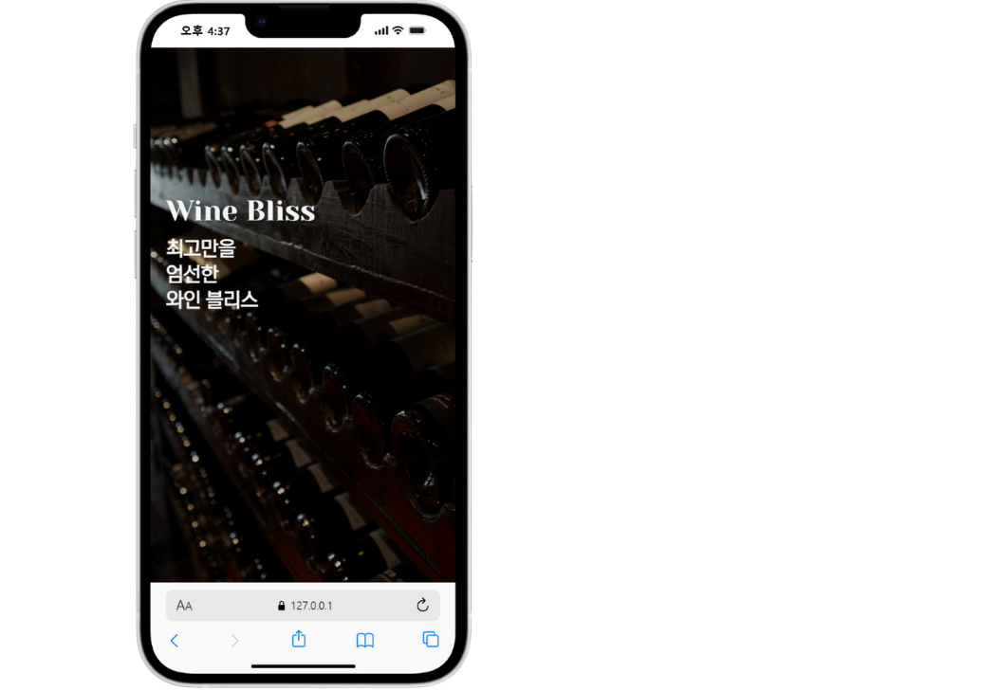
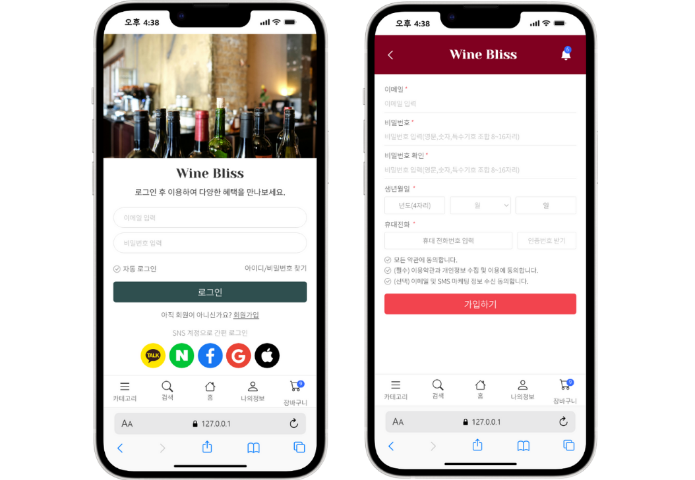
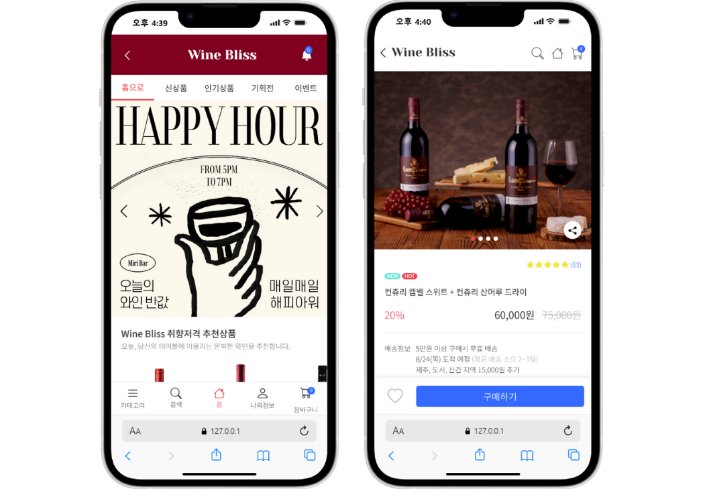
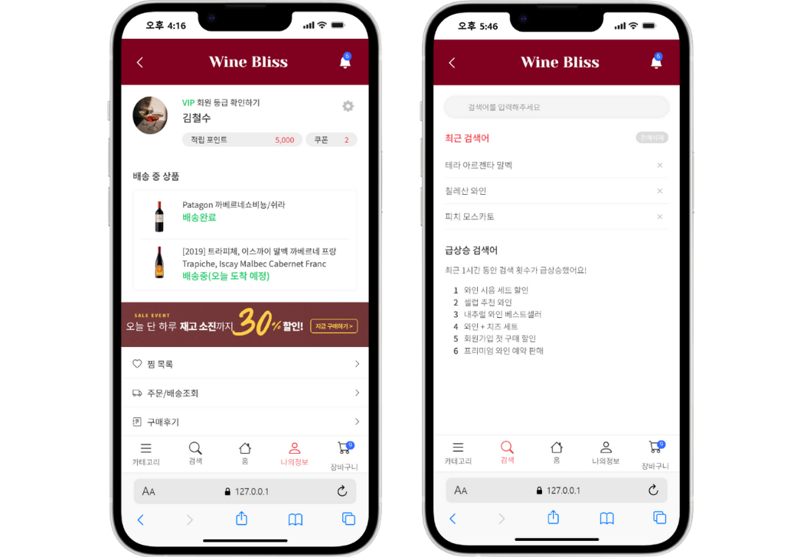
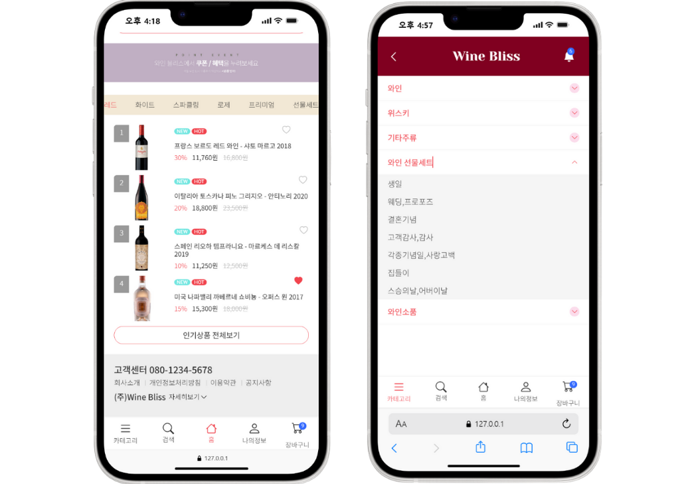

# Wine Mobile Web

Mobile-first storefront for browsing, searching, and purchasing wines. This repository contains static HTML/CSS/JS pages and mockups to preview the mobile UI.

## Pages

| Page            | Description                                                              |
| --------------- | ------------------------------------------------------------------------ |
| 메인 홈페이지       | 와인 상품 진열, 신상품 및 인기상품 배지 표시, 카테고리 네비게이션    |
| 상품 상세 페이지    | 와인 상품 정보, 가격, 할인율, 구매 버튼, 관련 상품 추천            |
| 장바구니            | 선택한 상품 목록, 수량 조절, 총 금액 계산, 주문 진행                |
| 마이페이지          | 주문 내역, 배송 상태, 개인정보 관리, 찜한 상품 목록                |
| 검색 페이지         | 와인 검색, 필터링 옵션, 정렬 기능, 검색 결과 표시                  |
| 로그인/회원가입     | 사용자 인증, 회원 정보 관리, 비밀번호 찾기                         |
| 카테고리 페이지      | 와인 종류별 분류, 가격대별 필터링, 정렬 옵션                        |

## Screenshots / UI Preview

### Loading



---

### Login / Sign Up



---

### Main Home & Product Detail



---

### Profile & Search



---

### Cart & Category



---

## Live Mockups

- Multi-view mockup: `mobile-mockup/multi-view.html`
- Single-view mockup: `mobile-mockup/single-view.html`
- Without mockup frame: `mobile-mockup/without-mockup.html`

Open the files directly in a browser or via a simple static server.

## Getting Started

1. Clone the repository.
2. Open `index.html` in your browser, or run a static server:

```bash
# Python 3
python -m http.server 3000
# Or Node
npx serve . -l 3000 --no-clipboard --single
```

Then visit `http://localhost:3000`.

## Tech Stack

- HTML5, CSS3 (vanilla + `css/` styles)
- JavaScript (vanilla) in `js/`

## Project Structure

```text
Wine_Mobile_Web/
├─ index.html
├─ style.css
├─ css/
├─ js/
├─ images/
├─ include/
├─ html/
└─ mobile-mockup/
```

## Roadmap (Next Implementations)

- Implement category browsing with filter and sort interactions
- Complete product detail pricing logic (discount/strike-through)
- Cart quantity sync and total recalculation edge cases
- Search filters (type, price range, country, sweetness) and result sorting
- Authentication flows (validation, error states, password recovery)
- My Page: order tracking states and wishlist management

## Contributing

1. Create a feature branch.
2. Commit with clear messages.
3. Open a Pull Request.
